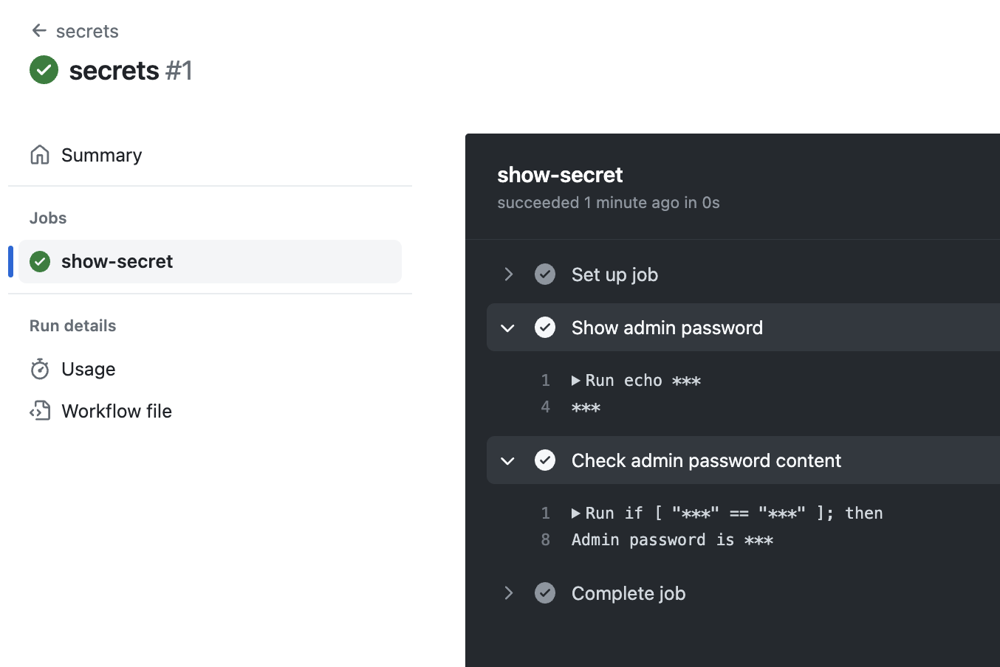

# GitHub Actions: Secrets

> **Keep your sensitive data safe and sound**

## Overview

GitHub Secrets is a powerful feature that allows you to store and manage sensitive data, such as API keys, tokens, and passwords, in a secure and encrypted manner. By using GitHub Secrets, you can keep your sensitive data safe and secure, while still being able to use it in your workflows.

## How do GitHub Secrets work?

GitHub Secrets are encrypted environment variables that can be used in your GitHub Actions workflows. When you create a secret, GitHub encrypts the value and stores it securely. The secret can then be used in your workflows by referencing the name of the secret. GitHub will automatically decrypt the value and make it available to your workflow.

To create a secret in GitHub, you can go to the **Settings** of your repository and navigate to the **Secrets and variables** tab. From there, you can create a new secret by providing a name and the value of the secret. It's important to note that once you create a secret, **you cannot view or edit the value again**.

It's also worth noting that GitHub Secrets can also be used to store sensitive data for use in GitHub Actions workflows that run on GitHub-hosted runners. This means that you can store and use secrets in your workflows without having to worry about them being exposed in plain text.

## Benefits of GitHub Secrets

- Security: GitHub Secrets provide a secure way to store and use sensitive information in your workflows. By encrypting the value of the secret, GitHub ensures that the secret is only accessible to authorized users.

- Convenience : GitHub Secrets make it easy to manage and use sensitive information in your workflows. Once you have created a secret, you can reference it in your workflows without having to manually enter the sensitive information each time.

- Flexibility: GitHub Secrets are highly flexible and can be used in a wide range of scenarios. You can use secrets to authenticate with external services, deploy code to servers, and much more.

## Example

Let's take a look at an example:

```yaml
# File: .github/workflows/secrets.yaml
name: secrets
on:
  workflow_dispatch:

jobs:
  show-secret:
    runs-on: ubuntu-latest
    steps:
      - name: Show admin password
        run: echo ${{ secrets.ADMIN_PASSWORD }}
      
      - name: Check admin password content
        run: |
          if [ "${{ secrets.ADMIN_PASSWORD }}" == "password123" ]; then
            echo "Admin password is password123"
          else
            echo "Admin password is not password123"
          fi
```

Here we have a workflow that shows how to use GitHub Secrets. The workflow contains two steps: one that attempts to show the value of the `ADMIN_PASSWORD` secret and one that checks the value of the `ADMIN_PASSWORD` secret.

The output logs of the workflow are shown below:



We can see that although the conditional evaluates to true, nowhere in the output logs is our password exposed. This is because the value of the `ADMIN_PASSWORD` secret is encrypted and stored securely on GitHub's servers.

## Summary

GitHub Secrets provide a secure and convenient way to manage and use sensitive information in your workflows. By using secrets, you can ensure that your workflows are secure and that your
sensitive information is protected. Whether you're deploying code to servers or authenticating with external services, GitHub secrets offer a flexible and powerful way to manage your secrets.

## References

- [**Encrypted secrets**](https://docs.github.com/en/actions/security-guides/encrypted-secrets)
