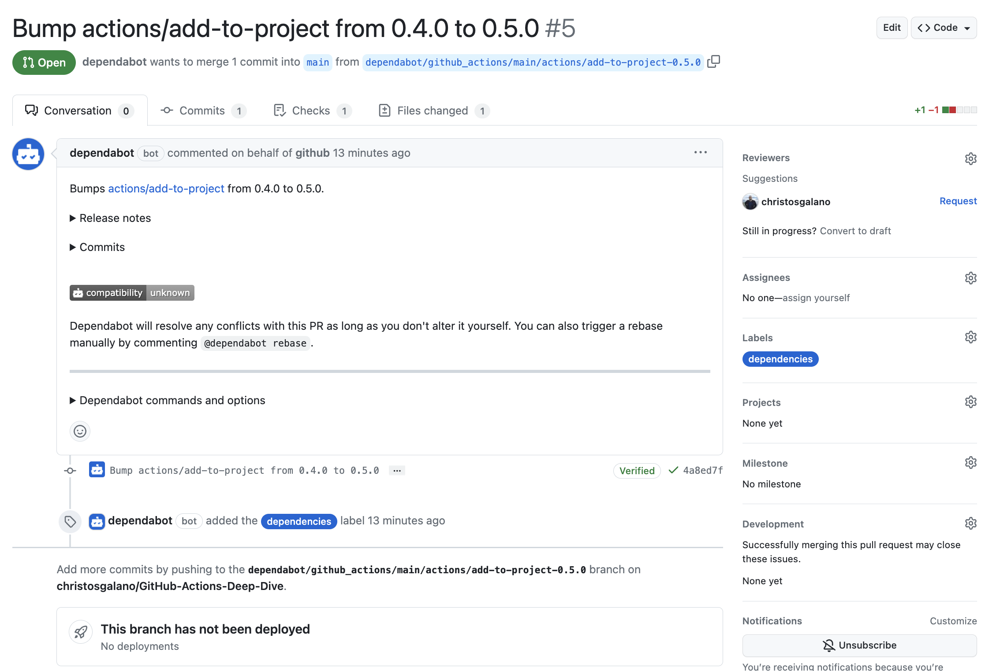

# GitHub Dependabot: Keeping Your Dependencies Up-to-Date

## Overview

As an engineer, you rely on various dependencies to build your applications or workflows. However, managing these dependencies can be a time-consuming and challenging task. Fortunately, GitHub Dependabot can help you automate this process and keep your dependencies up-to-date.

## What is GitHub Dependabot?

GitHub Dependabot is a tool that automates the process of checking for and installing updates to your project's dependencies. It integrates seamlessly with GitHub, and you can configure it to monitor your repositories and create pull requests to update your dependencies automatically.

## How does Dependabot work?

Dependabot works by periodically scanning your repositories for outdated dependencies. It checks the version numbers of your dependencies against the latest available versions and generates a list of updates. Dependabot then creates a pull request for each update, which you can review and merge.

You can configure Dependabot to create pull requests for all updates or only for security updates. You can also set the frequency of scans and choose which package managers to monitor.

## Benefits of using Dependabot

1. **Saves time**: Dependabot automates the process of checking for and installing updates to your dependencies. This saves you time and allows you to focus on more critical tasks.

2. **Improves security**: Dependabot scans for security updates, which can help you keep your applications and workflows secure and protect against vulnerabilities.

3. **Easy to configure**: Dependabot is easy to configure and integrate into your workflow. You can set it up quickly and start receiving updates without any extra effort.

4. **Reduces technical debt**: Outdated dependencies can result in technical debt and make it difficult to maintain your applications. Dependabot helps you stay up-to-date with the latest versions, reducing technical debt and making it easier to maintain your codebase.

## Example

The following example configures Dependabot to scan for updates to GitHub Actions and create a pull request for each update. It also sets the frequency of scans to daily and limits the number of open pull requests to three:

```yaml
# .github/dependabot.yaml
version: 2
updates:
  - package-ecosystem: "github-actions"
    directory: "/"
    schedule:
      interval: "daily" # only on weekdays
      time: "23:00"
      timezone: "Europe/Athens"
    target-branch: "main"
    open-pull-requests-limit: 3
    pull-request-branch-name:
      separator: "/"
```

And here is an example pull request that dependabot created:



## Summary

Keeping your dependencies up-to-date is critical for maintaining the security and stability of your applications. However, managing dependencies can be a time-consuming and challenging task. GitHub Dependabot automates this process, saving you time and improving the security of your applications. It's easy to configure and integrates seamlessly with GitHub, making it an essential tool for any engineer, whether it is software or devops.

## References

- [**GitHub Dependabot**](https://docs.github.com/en/code-security/supply-chain-security/keeping-your-dependencies-updated-automatically/about-dependabot-version-updates)
